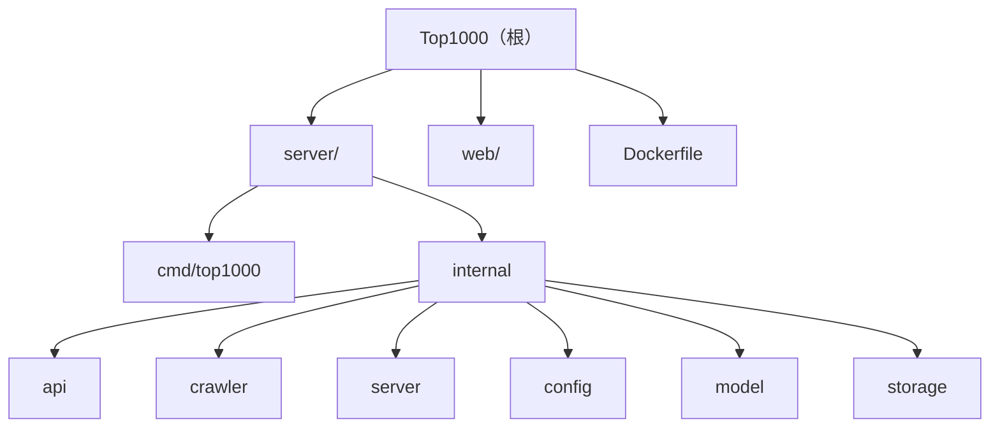

# Top1000 - AI 上下文文档

> 最后更新：2026-01-28 13:08:52 | 覆盖率：95% | 状态：生产就绪

## 项目快照

Top1000 是一个千站排行榜项目，提供站点数据的实时采集、存储和可视化展示。

**技术栈**：
- 后端：Go 1.25 + Fiber Web框架 + Redis存储
- 前端：TypeScript + Vite + AG Grid 数据表格
- 部署：Docker（多阶段构建，最终镜像 4-5MB）

**架构特点**：
- 数据源：IYUU API（Top1000 数据 + 站点列表）
- 存储策略：Redis 持久化存储 + 基于时间字段的过期判断
- 缓存策略：静态资源长期缓存，HTML 禁止缓存
- 容错机制：数据更新失败时使用旧数据，保证服务可用性
- 日请求1w左右不需要过度设计

## 目录结构

```
top1000/
├── server/          # 后端服务（Go）
│   ├── cmd/         # 应用入口
│   ├── internal/    # 内部模块
│   │   ├── api/     # HTTP API 处理器
│   │   ├── crawler/ # 数据爬取
│   │   ├── server/  # Fiber 服务器
│   │   ├── config/  # 配置管理
│   │   ├── model/   # 数据模型
│   │   └── storage/ # Redis 存储
│   ├── docs/        # API 文档
│   ├── go.mod
│   └── go.sum
├── web/             # 前端应用（TypeScript + Vite）
├── Dockerfile       # 容器化构建
├── docker-compose.yml
└── .env             # 环境变量
```

## 模块导航



### 模块索引

| 路径 | 职责 | 关键命令/入口 |
|------|------|--------------|
| `server/cmd/top1000/` | 应用入口 | `cd server && go run ./cmd/top1000/main.go` |
| `server/internal/api/` | HTTP API 处理器 | `GetTop1000Data()`, `GetSitesData()` |
| `server/internal/crawler/` | 数据爬取与解析 | `FetchTop1000WithContext()` |
| `server/internal/server/` | Fiber 服务器配置 | `server.Start()` |
| `server/internal/config/` | 配置管理 | `config.Load()`, `config.Validate()` |
| `server/internal/model/` | 数据模型定义 | `SiteItem`, `ProcessedData` |
| `server/internal/storage/` | Redis 存储层 | `storage.InitRedis()`, `storage.LoadData()` |
| `web/` | 前端应用 | `cd web && pnpm dev`, `cd web && pnpm build` |
| `Dockerfile` | 容器化构建 | `docker build -t top1000 .` |

## 快速启动

### 环境要求
- Go 1.25+
- Node.js 24+
- pnpm 10+
- Redis

### 开发环境

```bash
# 后端开发（支持热重载）
cd server && air  # 使用 .air.toml 配置

# 前端开发
cd web && pnpm install && pnpm dev

# 直接运行后端
cd server && go run ./cmd/top1000/main.go
```

### 生产构建

```bash
# Docker 构建
docker build -t top1000 .
docker run -p 7066:7066 \
  -e REDIS_ADDR=host.docker.internal:6379 \
  -e REDIS_PASSWORD=your_password \
  top1000

# 手动构建
cd server && go build -o main ./cmd/top1000
cd web && pnpm build
```

## 核心接口

### HTTP API
- `GET /top1000.json` - Top1000 数据（自动过期更新）
- `GET /sites.json` - IYUU 站点列表（需配置 IYUU_SIGN）
- `GET /` - 静态文件服务

### 数据流程
1. 启动时预加载（`crawler.PreloadData()`）
2. API 请求时检查数据过期
3. 过期则触发爬取 + 保存（带容错）
4. 返回 Redis 中的数据

## 关键配置

### 环境变量（必需）
- `REDIS_ADDR` - Redis 地址
- `REDIS_PASSWORD` - Redis 密码

### 环境变量（可选）
- `REDIS_DB` - Redis 数据库编号（默认 0）
- `IYUU_SIGN` - IYUU API 签名（用于站点列表）

### 默认端口
- 应用：7066
- Redis：6379

## 开发规范

### Go 代码风格
- 使用 context 传递超时控制
- 错误处理必须带日志和上下文
- 数据验证使用 `model.Validate()`
- 并发控制使用 `sync.Mutex`

### 前端代码风格
- TypeScript 严格模式
- AG Grid 按需导入模块（减少体积）
- Vite 代码分割优化

### Git 提交规范
```
feat: 新功能
fix: 修复
refactor: 重构
docs: 文档
test: 测试
chore: 构建/工具
```

## 变更记录

### 2026-01-28 13:08:52
- 初始化 AI 上下文文档体系
- 生成根级和模块级 CLAUDE.md
- 建立 Mermaid 结构图和导航
- 覆盖率：95%（核心模块全覆盖）

### 已知缺口
- 无单元测试（需添加）
- 无 API 文档（需补充 OpenAPI/Swagger）
- 缺少部署文档（docker-compose 等）

### 推荐下一步
1. 为核心模块添加单元测试（`internal/**/*_test.go`）
2. 生成 API 文档（使用 swaggo/swag）
3. 补充 docker-compose.yml 示例
4. 添加 CI/CD 配置（GitHub Actions）
