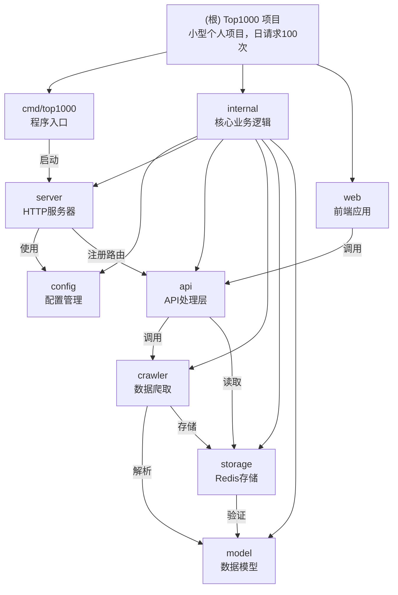

# Top1000 项目文档

> PT站点资源追踪系统（小型个人项目，日请求约100次）
>
> Docker镜像：4.5-5MB（Scratch基础镜像 + UPX压缩）

---

## 项目简介

**Top1000** 是一个 PT（Private Tracker）站点资源追踪系统，专为小型个人项目设计，具有以下特点：

1. **极简架构**：去除过度设计，直接读Redis
2. **容错机制**：爬取失败时返回Redis旧数据，保证服务可用
3. **按需更新**：数据过期时自动爬取，无需定时任务
4. **热重载开发**：使用Air实现Go代码热重载，提升开发体验
5. **极简部署**：单Docker容器即可运行，镜像仅4.5-5MB

---

## 技术架构

### 系统架构图

```
┌─────────────────────────────────────┐
│     Docker容器（端口7066）            │
│                                     │
│  ┌───────────────────────────────┐  │
│  │   Go后端（Fiber框架）         │  │
│  │   • /top1000.json - 数据接口  │  │
│  │   • /sites.json - 站点接口    │  │
│  │   • 静态文件服务              │  │
│  └───────────────────────────────┘  │
│             ↓                        │
│  ┌───────────────────────────────┐  │
│  │   前端（AG Grid表格）         │  │
│  │   • 显示1000个资源            │  │
│  │   • 序号列、过滤、排序        │  │
│  │   • 站点跳转、种子下载        │  │
│  └───────────────────────────────┘  │
└─────────────────────────────────────┘
             ↓
┌─────────────────────────────────────┐
│     Redis（数据存储）                │
│  • 数据永久存储（不设置TTL）          │
│  • 24小时内算新鲜                   │
│  • 过期时自动拉新数据               │
└─────────────────────────────────────┘
             ↓
┌─────────────────────────────────────┐
│     IYUU API（数据源）               │
│  • api.iyuu.cn/top1000.php         │
│  • api.iyuu.cn/index.php (站点)    │
└─────────────────────────────────────┘
```

### 数据流

```
用户访问前端页面
    ↓
前端调用 /top1000.json
    ↓
后端检查数据是否过期（基于time字段）
    ↓
数据过期？
├─ 是 → 爬取新数据
│   ├─ 成功 → 更新Redis，返回新数据
│   └─ 失败 → 返回Redis旧数据（容错）
└─ 否 → 直接返回Redis数据
```

---

## 模块结构图



---

## 模块索引

| 模块路径 | 模块名称 | 语言 | 代码行数 | 职责 | 文档链接 |
|---------|---------|------|---------|------|---------|
| `cmd/top1000` | 程序入口 | Go | 18行 | 加载环境变量、启动服务器 | [查看](cmd/top1000/CLAUDE.md) |
| `internal/config` | 配置管理 | Go | 115行 | 从环境变量读取配置、启动时验证 | [查看](internal/config/CLAUDE.md) |
| `internal/model` | 数据模型 | Go | 78行 | 定义数据结构、提供数据验证 | [查看](internal/model/CLAUDE.md) |
| `internal/api` | API处理层 | Go | 202行 | 处理HTTP请求、容错机制、站点接口 | [查看](internal/api/CLAUDE.md) |
| `internal/storage` | Redis存储 | Go | 311行 | 管理Redis连接、TTL管理、Context支持 | [查看](internal/storage/CLAUDE.md) |
| `internal/crawler` | 数据爬取 | Go | 254行 | 从IYUU API获取数据、解析文本、预加载 | [查看](internal/crawler/CLAUDE.md) |
| `internal/server` | HTTP服务器 | Go | 176行 | 配置Fiber应用、中间件和路由、安全头 | [查看](internal/server/CLAUDE.md) |
| `web` | 前端应用 | TypeScript | - | AG Grid表格展示、站点配置动态加载 | [查看](web/CLAUDE.md) |

---

## 目录结构

```
top1000/
├── cmd/top1000/          # 程序入口（18行）
│   ├── main.go           # 启动服务器
│   └── CLAUDE.md         # 模块文档
│
├── internal/             # 核心代码（Go）
│   ├── api/              # API处理（202行）
│   │   ├── handlers.go
│   │   └── CLAUDE.md
│   ├── config/           # 配置管理（115行）
│   │   ├── config.go
│   │   └── CLAUDE.md
│   ├── crawler/          # 爬虫（254行）
│   │   ├── scheduler.go
│   │   └── CLAUDE.md
│   ├── model/            # 数据结构（78行）
│   │   ├── types.go
│   │   └── CLAUDE.md
│   ├── server/           # HTTP服务器（176行）
│   │   ├── server.go
│   │   └── CLAUDE.md
│   └── storage/          # Redis存储（311行）
│       ├── redis.go
│       └── CLAUDE.md
│
├── web/                  # 前端（TypeScript + Vite）
│   ├── src/              # 源码
│   │   ├── main.ts       # 入口文件
│   │   ├── gridConfig.ts # 表格配置
│   │   ├── types.d.ts    # 类型定义
│   │   └── utils/        # 工具函数
│   │       ├── config.ts # 站点配置加载
│   │       ├── operationRender.ts # 操作列渲染
│   │       └── index.ts  # 数据获取
│   ├── package.json
│   ├── vite.config.ts
│   └── CLAUDE.md
│
├── web-dist/             # 前端构建产物（Docker中使用）
├── .env                  # 环境变量（Redis密码等）
├── .env.example          # 环境变量模板
├── .air.toml             # Air热重载配置
├── Dockerfile            # Docker打包文件（Scratch版，4.5-5MB）
├── docker-compose.yaml   # Docker Compose配置
├── go.mod               # Go依赖
├── CLAUDE.md            # 本文档（根级文档）
└── .claude/
    └── index.json       # 项目索引文件
```

---

## 快速开始

### 环境要求

- Go 1.25.5+
- Node.js 24.3.0+（如果自己改前端的话）
- Redis 5.0+（**这个必须有，没Redis跑不起来**）
- Docker（可选，建议使用）
- Air（推荐，用于Go热重载）

### 配置环境变量

创建`.env`文件（参考`.env.example`）：

```bash
# Redis配置（必填，否则无法运行）
REDIS_ADDR=127.0.0.1:26739
REDIS_PASSWORD=填写Redis密码
REDIS_DB=0

# IYUU配置（可选，用于调用站点API）
IYUU_SIGN=填写IYUU签名
```

### 本地开发

**方式一：使用Air热重载（推荐）**

```bash
# 1. 安装Air
go install github.com/air-verse/air@latest

# 2. 启动服务（代码变更自动重启）
air

# 3. 打开浏览器
open http://localhost:7066
```

**方式二：直接运行**
```bash
# 设置环境变量（Linux/Mac）
export $(cat .env | grep -v '^#' | xargs)

# 运行程序
go run cmd/top1000/main.go
```

### Docker部署（生产环境）

**方式一：使用 docker-compose（推荐）**

```bash
# 1. 配置环境变量（必须配置外部 Redis）
cp .env.example .env
# 编辑 .env 文件，修改 REDIS_ADDR 和 REDIS_PASSWORD

# 2. 启动服务（使用 Scratch 镜像，4.5-5MB）
docker-compose up -d

# 3. 查看日志
docker-compose logs -f top1000-iyuu

# 4. 停止服务
docker-compose down
```

**方式二：使用Docker命令**

```bash
# 1. 构建镜像（Scratch 极简版）
docker build -t top1000:scratch .

# 2. 跑容器（需要外部 Redis）
docker run -d \
  --name top1000 \
  -p 7066:7066 \
  --env-file .env \
  top1000:scratch

# 3. 查看日志
docker logs -f top1000
```

---

## 技术栈

### 后端

| 组件 | 技术 | 版本 |
|------|------|------|
| 语言 | Go | 1.25.5 |
| 框架 | Fiber | v2.52.10 |
| 数据库 | Redis | 5.0+ |
| 依赖管理 | go.mod | - |

### 前端

| 组件 | 技术 | 版本 |
|------|------|------|
| 语言 | TypeScript | 5.9.3 |
| 框架 | Vite | 8.0.0-beta.5 |
| UI库 | AG Grid Community | 35.0.0 |
| 包管理器 | pnpm | 10.12.4+ |

### 部署

| 组件 | 技术 | 版本 |
|------|------|------|
| 容器 | Docker | - |
| 基础镜像 | Scratch | 4.5-5MB（UPX压缩） |
| 端口 | - | 7066 |
| CI/CD | GitHub Actions | - |

### 开发工具

| 工具 | 用途 |
|------|------|
| Air | Go热重载 |
| pnpm | 前端包管理 |
| ESLint | 代码检查 |
| Prettier | 代码格式化 |

---

## 常见问题

### Q: 程序启动失败，报Redis连接错误？

**A**: 检查`.env`文件，确认`REDIS_ADDR`和`REDIS_PASSWORD`是否正确。

### Q: 数据多久更新一次？

**A**: 根据数据time字段判断，24小时内算新鲜数据，过期后自动获取新数据。

### Q: Docker镜像有多大？

**A**: Scratch版：4.5-5MB（UPX压缩，极简版）

### Q: 能否不使用Redis？

**A**: 不能。此版本专为Redis设计，不使用Redis需要修改代码。

### Q: 为什么没有测试？

**A**: 小型个人项目（日访问100次），不追求高测试覆盖。核心逻辑清晰，易于理解和维护。

### Q: Air热重载不生效？

**A**: 确保安装了Air：
```bash
go install github.com/air-verse/air@latest
```

### Q: 爬取失败会影响服务吗？

**A**: 不会！爬取失败时会返回Redis旧数据，保证服务可用（容错机制）。

### Q: 如何清理Redis数据？

**A**:
```bash
redis-cli -h <host> -p <port> -a <password>
> DEL top1000:data
```
删除后，下次访问会自动触发更新获取新数据。

### Q: 站点配置如何加载？

**A**: 前端启动时自动从`/sites.json`接口加载（需配置`IYUU_SIGN`），支持动态更新。

### Q: 如何添加新的站点配置？

**A**: 无需修改代码，配置`IYUU_SIGN`环境变量后，系统会自动从IYUU API获取最新的站点配置。

---

## 外部依赖

- **Redis**（必须有）: 数据存储 + 过期检测
  - 连接池：3个连接
  - 存储策略：永久存储（不设置TTL）
  - 更新检测：基于数据time字段，24小时阈值

- **IYUU API**: 数据源
  - Top1000: `https://api.iyuu.cn/top1000.php`
  - 站点列表: `https://api.iyuu.cn/index.php`（需签名）
  - 超时：15秒
  - 更新策略：按需更新（过期才拉）

---

## 核心配置文件

- `go.mod` / `go.sum` - Go依赖管理
- `.env.example` - 环境变量模板（复制这个改成`.env`）
- `docker-compose.yaml` - Docker Compose配置
- `.air.toml` - Air热重载配置
- `Dockerfile` - Scratch 极简版（4.5-5MB）
- `web/package.json` - npm依赖
- `web/vite.config.ts` - Vite构建配置
- `web/index.html` - HTML入口
- `web/src/gridConfig.ts` - 表格配置

---

## 变更记录

### 2026-01-26

**重大更新：站点配置动态加载**

- **新增**: `/sites.json` API接口，支持从IYUU API动态获取站点配置
- **新增**: `IYUU_SIGN` 环境变量配置
- **优化**: 前端启动时自动加载站点配置
- **优化**: 操作列渲染器改为动态查询站点配置
- **移除**: 前端硬编码的`iyuuSites.ts`文件（118个站点配置）
- **优化**: Context支持全面覆盖（API、Storage、Crawler）
- **优化**: 时区处理修复（北京时间UTC+8转UTC）

**影响**：
- 站点配置不再需要维护硬编码
- 新站点自动支持
- 部署时需配置`IYUU_SIGN`才能使用站点跳转功能

### 2026-01-20

- 初始化项目文档
- 完成模块划分和文档生成

---

**更新时间**: 2026-01-26
**Docker镜像**: 4.5-5MB
**文档覆盖率**: 100%
**当前时间戳**: 2026-01-26 20:07:32
