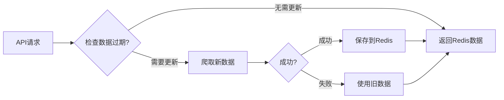

# internal/api - API 处理层

[根目录](../../CLAUDE.md) > [internal](../) > **api**

## 模块快照

**职责**：HTTP API 接口处理、数据更新调度、容错机制

**关键文件**：`handlers.go`

**核心接口**：
- `GetTop1000Data()` - Top1000 数据接口（带过期检查和自动更新）
- `GetSitesData()` - IYUU 站点列表接口（需配置 IYUU_SIGN）

## 数据流程

## 关键特性

1. **自动过期检查**：基于数据时间字段判断（24小时阈值）
2. **容错机制**：爬取失败时使用旧数据
3. **并发控制**：防止同时多次更新
4. **超时保护**：15秒 API 超时

## 依赖关系

- `github.com/gofiber/fiber/v2` - Web 框架
- `internal/config` - 配置管理
- `internal/crawler` - 数据爬取
- `internal/storage` - Redis 存储

## 测试

无测试文件。

**建议**：添加接口测试、并发测试、容错测试。

---

*文档生成时间：2026-01-28 13:08:52*
